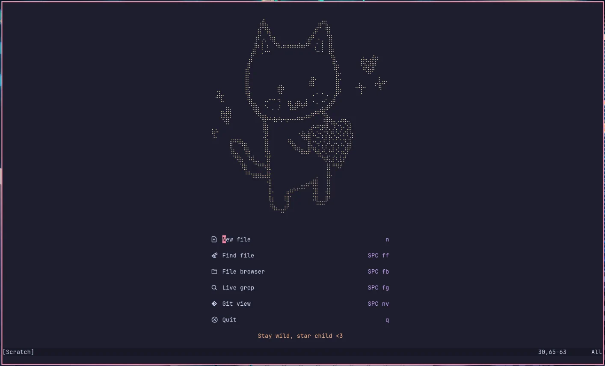

// SPDX-FileCopyrightText: 2025 Name <lasagna@garfunkle.space>
//
// SPDX-License-Identifier: CC-BY-SA-4.0

= NVaMe: My personal Neovim flake!
Name <lasagna@garfunkles.space>

== Includes

=== Main config (`mainConfig`)

Neovim:

* Catppuccin Mocha + rainbow-delimeters
* Treesitter setup for plenty of languages
* LSP configuration for plenty of languages
* Completions and snippets (Provided by friendly-snippets)
* Telescope setup
* Git integrations with fugitive and git-signs

Bonus tools:

* ripgrep for faster live grepping
* fd for faster file finding
* nixfmt-rfc-style for formatting
* LSPs for Nix, Latex + text docs and Lua

== Usage

To get started all you need is a system with Nix installed! +
If you don't have Nix installed, you shouldn't be looking at this anyway.

=== Adding LSPs

The actual language servers themselves aren't installed (besides the Nix, Latex, and Lua LSPs). +
This is intentional as ideally you should be installing the language servers within your project's devshell.

For information on reccomended LSP's, xref::./docs/lsps.adoc#recs[check out the LSP manpage (`man 5 nvame-lsps`)]

=== Temporary usage

To run it once on a file just do:

[source,shell]
----
nix run github:namescode/nvame -- file.txt
----

For use in a shell just do:

[source,shell]
----
nix shell github:namescode/nvame --command $SHELL
----

=== Installing as a package

Firstly add the following to your inputs; this will pull in the flake for use:

[source,nix]
----
nvame.url = "github:namescode/nvame";
----

Then, install the packages you need through `inputs.nvame.packages.${system}` (Make sure to pass `inputs` as an attribute). + 
For example:

[source,nix]
----
environment.systemPackages = with pkgs; [
  git
  hyfetch

  # Installs the main nvame config
  (inputs.nvame.packages.${system}.mainConfig)
];
----
